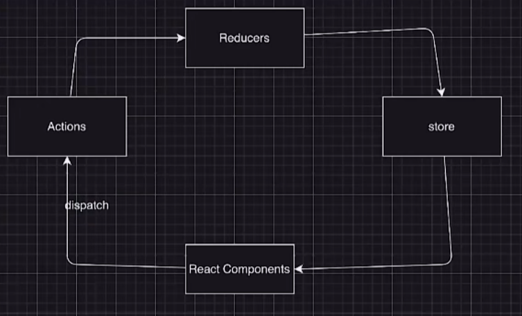

# Redux 工作原理

状态管理库
- 单向数据流
- 跨层级组件数据共享与通信
- 需要持久化的全局数据 用户登录信息

## 包含
- Store 一个全局的状态管理对象
- Reducer 一个纯函数 根据旧state和props更新新state
- Action 改变状态的唯一方法 dispatch action

## 关键概念
- 单一数据源：Redux 应用程序中的整个状态被存储在单一的 JavaScript 对象中。这个对象被称为 "state"，并且在应用程序中是唯一的数据源。这个单一数据源的设计使得状态管理变得简单且可预测。

- 状态是只读的：Redux 中的状态是不可变的，意味着你不能直接修改状态。如果你想要改变状态，你必须通过发起一个 action 来描述你想要发生的变化。

- 通过纯函数来执行状态的修改：为了描述状态的变化，你需要编写纯函数，这些函数被称为 reducers。一个 reducer 接收先前的状态和一个 action，并返回一个新的状态。这个过程是纯函数式的，没有副作用，保证了可预测性。

- 通过派发 actions 来触发状态的变化：为了修改状态，你需要派发一个 action。一个 action 是一个普通的 JavaScript 对象，包含一个描述变化的 type 字段和可选的 payload 字段。当你派发一个 action 时，Redux 会将该 action 传递给 reducer，reducer 根据 action 的类型来更新状态。

- 使用 Store 来管理状态：Redux 应用程序使用一个称为 Store 的对象来管理状态。Store 保存了应用程序的状态，提供了几个方法来获取状态、派发 actions，并注册监听器以便在状态发生变化时执行相应的逻辑。

