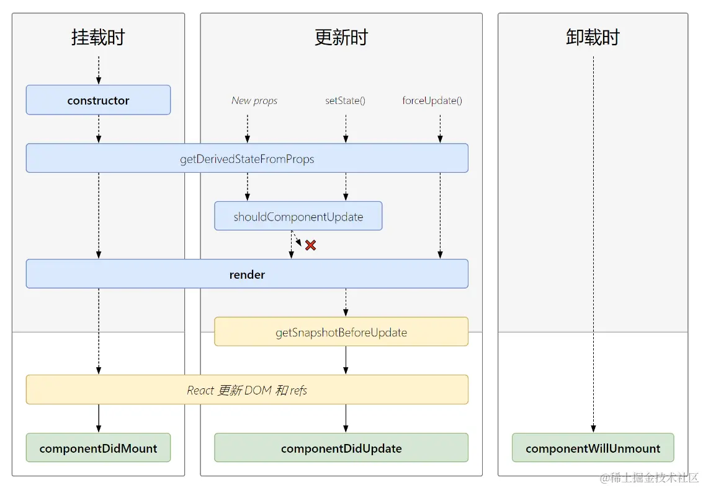

## react16.8+ 生命周期主要分为三个阶段
- 挂载阶段
- 更新阶段
- 销毁阶段

### 挂载阶段
- `constructor`: 定义this，初始化state
- `static getDerivedStateFromProps`: 静态方法，修改state
- `render`：纯函数，返回原生的DOM、React组件、Fragment、Portals、字符串和数字、Boolean和null等内容

### 更新阶段
- `state更新`
- `static getDerivedStateFromProps`: 静态方法，修改state 
- `showComponentUpdate`: 可以优化渲染，有2个参数，nextProps, nextState, 默认返回true， true表示会触发重新渲染，false表示不会， ***可以避免不必要的渲染，提高应用程序的性能***
> 1. shouldComponentUpdate默认情况下会比较前后的props和state，但这是一个浅比较。如果props或state是复杂对象（如数组或对象），你可以在shouldComponentUpdate中手动实现深度比较，以确保只有在真正的改变发生时才触发重新渲染。
> 2. 使用PureComponent或React.memo：PureComponent和React.memo是React提供的优化工具，它们会在shouldComponentUpdate中自动执行浅比较。使用这些工具可以减少手动实现shouldComponentUpdate的工作，并且能够提供更好的性能。
> 3. 提前退出：如果你可以在shouldComponentUpdate中确定组件不需要更新，可以提前返回false，以避免不必要的渲染。
> 4. 避免过多的prop传递：尽量避免在组件之间传递过多的props，因为这会增加shouldComponentUpdate的比较成本。如果可能的话，尝试将组件拆分成更小的部分，以减少props传递的数量。
> 5. 使用不可变数据：使用不可变数据结构可以帮助React更容易地检测到数据的变化，从而更准确地判断是否需要重新渲染。
> 6. 性能监控和分析：最后，你可以使用React的性能监控工具来分析组件的渲染性能，并找出需要优化的部分。React DevTools是一个很好的工具，可以帮助你监控组件的性能并进行分析。

- `render`: 返回内容
- `getSnapShotBeforeUpdate`: 有两个参数，prevProps, prevState，表示之前的属性和state，这个函数有一个返回值，会作为第三个参数传给`componentDidUpdate`
- `componentDidUpdate`: 有三个参数，prevProps,  prevState, snapshot, 第三个参数是 getSnapShotBeforeUpdate 返回的， 如果触发某些回调函数时需要用到DOM元素的状态，则将对比或计算的过程迁移至 *getSnapShotBeforeUpdate* ，然后在 compoentDidUpdate 中统一触发回调或更新状态。

### 卸载阶段
- `componentWillUnmount`: 组件被卸载或者销毁了就会调用，可以在这个函数里去清除一些定时器，取消网络请求，清理无效的DOM元素等垃圾清理工作

另外还需要注意的是`错误处理阶段`

- `static getDerivedStateFromError(error)`（React 16 新增）：当子组件抛出错误（通过抛出异常）时，会调用此方法，并将错误传递给方法。它可以用于在渲染阶段捕获错误，返回一个状态对象来更新组件的状态。这个方法在组件的子组件抛出错误后调用，可以在此方法中捕获错误并记录错误信息。可以在此方法中返回一个状态对象来更新组件的状态，以便在渲染阶段显示错误信息。

- `componentDidCatch(error, info)`（React 16 新增）：在子组件抛出错误后调用，用于记录错误信息或发送错误报告。在这个方法中可以通过参数 error 和 info 来获取错误的详细信息，并进行相应的处理，比如将错误信息发送到后端服务器或者错误日志监控系统。

